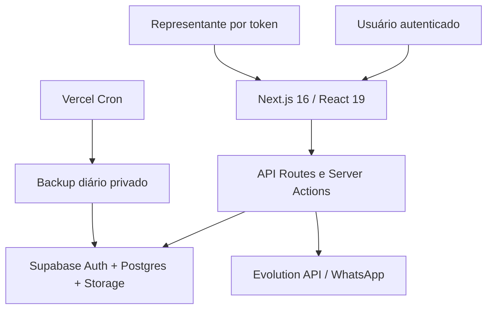

# MBA Cotações — Relatório Técnico de QA e Preparação para Produção

Data: 24/09/2026  
Repositório: `mauriciobarrosaguiar/mbalabs`  
Aplicação canônica: `apps/mba-labs-core`  
Versão-base: `576abae`  

## Resumo executivo

A arquitetura atual foi preservada. Não foi criada uma nova aplicação e o legado `apps/mba-cotacoes` não foi alterado. Foram corrigidos defeitos de autorização, cálculo, estoque, CNPJ, idempotência, tokens públicos, logs, datas e segurança do WhatsApp. Foi adicionada massa QA reutilizável, suíte Vitest e suíte Playwright com golden path e teste simultâneo de duas farmácias.

O código local compila e os 19 testes unitários/de integração passam. A migration corretiva foi aplicada com sucesso em um projeto Supabase QA isolado, que recebeu 3 empresas, 9 contas Auth, 180 produtos, 18 representantes, respostas e pedidos fictícios. Nesse ambiente passaram login Auth, isolamento RLS por usuário, tentativa de IDOR por UUID, FK composta, CNPJ, ranking, total e idempotência de pedido. Contudo, produção **não deve ser considerada homologada**: os vínculos históricos cross-tenant ainda existem lá e o E2E autenticado de navegador/Evolution API continuam não validados.

### Estado resumido

| Área | Resultado |
|---|---|
| Build | PASSOU |
| Lint MBA Cotações | PASSOU |
| Typecheck MBA Cotações | PASSOU |
| Testes unitários/integração | 19/19 PASSOU |
| Testes Playwright executados | 0/30 esperados — PENDENTE (42 descobertos; 12 skips deliberados) |
| Multi-tenancy no QA | PASSOU — RLS, UUID direto e FK composta |
| Multi-tenancy no banco real | FALHOU — BLOQUEADOR |
| WhatsApp seguro para QA | PASSOU em unidade; integração NÃO VALIDADA |
| Ranking e estoque | PASSOU |
| Pedidos e arredondamento | PASSOU em unidade e persistência QA; UI PENDENTE |
| Mobile/desktop | Configurado; execução PENDENTE |
| Situação para produção | NÃO HOMOLOGADO |

## Arquitetura encontrada

- Monorepo npm workspaces; MBA Cotações vive no core compartilhado da MBA Labs.
- Frontend e backend em Next.js App Router, hospedados no mesmo projeto Vercel.
- Autenticação via Supabase Auth e perfil/empresa por `users_profile`, `tenant_users` e tabelas core.
- Operações privilegiadas usam `SUPABASE_SERVICE_ROLE_KEY` apenas em módulos marcados `server-only`/rotas servidor.
- Persistência operacional em Postgres/Supabase com `tenant_id` nas tabelas centrais.
- Links de representante e vencedor são públicos por token, sem expor o dashboard autenticado.
- WhatsApp usa configuração backend em `cot_whatsapp_global_config`, registros em `cot_whatsapp_envios`, Evolution API e webhook com segredo.
- Backup diário Vercel em `0 8 * * *`, gravado no bucket privado `mba-cotacoes-backups`.
- Não foi encontrada Edge Function versionada para este módulo; a lógica está em rotas Next.js.
- Há modos demo/localStorage no código, separados do modo operacional Supabase.

### Entidades principais

| Domínio | Tabelas/estruturas |
|---|---|
| Empresas e acesso | `tenants`, `pharmacies`, `users_profile`, `tenant_users`, tabelas core |
| Catálogo | `products`, `laboratories`, `distributors`, `suppliers`, `supplier_distributors` |
| Faltas | `shortage_items` |
| Cotação | `quotations`, `quotation_items`, `supplier_quote_sessions` |
| Resposta | `supplier_quote_responses`, `supplier_quote_response_items` |
| Resultado | awards calculados, `winner_order_pending_items` |
| Pedido | `purchase_orders`, `purchase_order_items` |
| Integração | `cot_whatsapp_global_config`, `cot_whatsapp_envios`, `audit_logs` |

### Rotas críticas revisadas

- CRUD: `/api/cotacoes/crud/[entity]`
- Cotação: `/api/cotacoes/quotations`
- Lista de faltas: `/api/cotacoes/shortage-items`
- Sessões: `/api/cotacoes/supplier-sessions`
- Resposta pública: `/api/cotacoes/public/supplier-response/[token]`
- Pedidos: `/api/cotacoes/purchase-orders/[quotationId]`
- Pedido público: `/cotacao/pedido/[token]`
- Exportações: `/api/cotacoes/export/...`
- WhatsApp e webhook: `/api/cotacoes/whatsapp-envios`, `/api/cotacoes/webhooks/evolution/status`
- Health e backup: `/api/cotacoes/health/supabase`, `/api/cotacoes/backup/supabase`
- Efi/Pix: `/api/cotacoes/webhooks/efi/pix` (stub, não pronto para produção financeira).

## Banco de dados e multi-tenancy

Todas as tabelas públicas relevantes consultadas estavam com RLS habilitado. As tabelas backend-only do WhatsApp não possuem policy para clientes, o que as bloqueia por RLS; a migration adiciona `REVOKE` explícito para `anon` e `authenticated`.

A camada HTTP faz autorização de tenant para CRUD, cotação, pedido, lista, exportação e telas autenticadas. O defeito grave encontrado foi a ausência de integridade referencial composta no banco: uma operação com service role podia relacionar UUID de fornecedor de outro tenant.

### Auditoria somente leitura do banco real

| Relação | Inconsistências |
|---|---:|
| Cotação → farmácia | 0 |
| Item → cotação | 0 |
| Sessão → cotação | 0 |
| Sessão → fornecedor | **11** |
| Resposta → sessão | 0 |
| Resposta → fornecedor | **9** |
| Item de resposta → item da cotação | 0 |
| Item de resposta → resposta | 0 |
| Item de resposta → fornecedor | **41** |
| Item de resposta → distribuidor | 0 |
| Pedido → cotação | 0 |
| Pedido → fornecedor | **3** |
| Item de pedido → pedido | 0 |
| Item de pedido → item da cotação | 0 |

As quatro colunas `supplier_id` afetadas aceitam `NULL`. A migration zera somente a referência cross-tenant e preserva snapshots de nome/empresa/contato e os registros históricos.

### Migration preparada

Arquivo: `supabase/migrations/20260924134029_harden_cotacoes_qa_and_idempotency.sql`

Ela adiciona:

- snapshot `quotations.buyer_document` e backfill;
- reparo conservador das quatro classes de referência cross-tenant;
- chaves únicas compostas `(id, tenant_id)`;
- foreign keys compostas propagando tenant entre cotação, itens, sessões, respostas e pedidos;
- unicidade para sessão por cotação/fornecedor, resposta por sessão, item por resposta/item, pedido por cotação/fornecedor e item por pedido/item;
- índices para foreign keys e consultas por tenant;
- grants/revokes explícitos das tabelas WhatsApp backend-only.

**Estado:** aplicada e testada no projeto QA isolado `ulabbmjxdvxxiybhtgnn`. A tentativa de branch falhou porque Branching exige plano Pro; foi usado projeto adicional Free, sem copiar dados de produção. A migration bloqueou referência tenant B → farmácia A com SQLSTATE `23503` e bloqueou pedido duplicado com `23505`. O projeto foi pausado ao final da rodada, preservando a evidência para retomada sem deixá-lo exposto. Ela **não foi aplicada em produção**.

## Massa de QA

Foram criados:

- `scripts/qa/seed-mba-cotacoes-qa.mjs`
- `scripts/qa/cleanup-mba-cotacoes-qa.mjs`
- `scripts/qa/qa-safety.mjs`

O seed produz, de forma repetível:

- Drogaria QA Palmas — CNPJ fictício matematicamente válido `11.222.333/0001-81`;
- Farmácia Sandbox Norte — `11.444.777/0001-61`;
- Drogaria Teste MBA — `11.999.888/0001-34`;
- 3 perfis por tenant: admin, comprador e consultor;
- 6 representantes/distribuidores por tenant;
- 60 produtos por tenant, incluindo ausência de EAN e variações;
- 12 itens de falta, cotação com 10 itens, respostas completas/sem estoque/pendente e pedido inicial;
- e-mails reservados `example.invalid` e nenhum WhatsApp aleatório.

O cleanup seleciona exclusivamente os três tenants com status `teste`, CNPJs QA e usuários de e-mail inválido. Nesta rodada ele foi corrigido para remover também `users_profile`, empresas/usuários core e Auth sem deixar órfãos. As duas proteções foram verificadas: sem flag QA e apontando ao project ref de produção, o script aborta antes de conectar.

### Execução da massa no Supabase QA

| Registro | Quantidade comprovada |
|---|---:|
| Empresas/tenants QA | 3 |
| Contas Supabase Auth | 9 |
| Produtos | 180 |
| Representantes/fornecedores | 18 |
| Itens de falta | 36 |
| Cotações | 3 |
| Respostas enviadas | 6 |
| Itens de resposta | 60 |
| Pedidos | 3 |

O login por senha de um comprador retornou sessão Auth válida. Consultando pelo token desse usuário, o RLS retornou somente a Drogaria QA Palmas; a leitura direta do UUID da Farmácia Sandbox Norte retornou zero linhas.

## Testes automatizados

### Vitest

Resultado: **19/19 testes aprovados em 5 arquivos**.

Coberturas principais:

- ranking de menor preço;
- desempate determinístico;
- exclusão de oferta sem estoque;
- resposta integralmente sem estoque;
- atendimento parcial e divisão de pedidos;
- cálculo e arredondamento monetário;
- isolamento lógico de dois tenants;
- token público aleatório;
- allowlist/mock/redirecionamento WhatsApp;
- conversão de deadline do Brasil;
- proteções do seed contra produção.

### Playwright

Foram criados os cenários públicos e `golden-path.qa.spec.ts`. A configuração cobre:

- desktop 1366×768 e 1920×1080;
- mobile 360, 375, 390, 412 e 430 px;
- token inválido;
- área pública sem dashboard;
- ausência de overflow horizontal;
- seletor de estoque;
- login, lista, cotação, resposta pública, ranking, finalização, geração repetida de pedido e link vencedor;
- dois contextos de farmácia simultâneos, alteração manual de URL e probe API sem mutação.

O teste mutável roda somente uma vez, recusa hosts/projeto de produção e intercepta o endpoint WhatsApp. A execução continua pendente: o projeto QA existe, mas o conector não fornece a chave server-side necessária ao Preview; localmente não há Chrome instalado e o download Playwright falhou repetidamente porque o CDN retornou arquivo de 0 MiB/truncado. Portanto, nenhum caso visual foi marcado como aprovado.

## Bugs encontrados

### BUG-001 — IDOR em exportação de licitação

- Severidade: **CRÍTICO**
- Área: autorização/multi-tenancy
- Problema: exportação por UUID usava service role sem comprovar tenant do usuário.
- Causa: ausência de `ensureQuotationAccess` na rota.
- Correção: autenticação, autorização por tenant e validação de módulo antes das leituras.
- Arquivo: `src/app/api/cotacoes/export/licitacao/[id]/route.ts`
- Teste: guardas de autorização revisadas; E2E cross-tenant criado.
- Resultado: **CORRIGIDO NO CÓDIGO; DEPLOY PENDENTE**.

### BUG-002 — Referências históricas cross-tenant

- Severidade: **CRÍTICO**
- Área: banco/multi-tenancy
- Problema: 11 sessões, 9 respostas, 41 itens e 3 pedidos referenciam fornecedores de outro tenant.
- Causa: FKs simples por UUID não carregavam `tenant_id`.
- Correção: saneamento conservador e FKs compostas na nova migration.
- Arquivo: `supabase/migrations/20260924134029_harden_cotacoes_qa_and_idempotency.sql`
- Teste: consulta somente leitura de 14 relações.
- Resultado: **PASSOU NO QA; FALHOU EM PRODUÇÃO — BLOQUEADOR; APLICAÇÃO EM PRODUÇÃO PENDENTE**.

### BUG-003 — Pedido ignorava vencedor parcial

- Severidade: **ALTO**
- Área: vencedores/pedidos
- Problema: awards com status `partial` não entravam no pedido, perdendo o primeiro lote mais barato.
- Causa: filtro aceitava apenas `winner`.
- Correção: incluir `partial` com quantidade positiva.
- Arquivo: `services/purchase-orders.ts`
- Teste: 20 unidades a R$ 8,00 + 80 a R$ 8,50 = 100/R$ 840,00.
- Resultado: **PASSOU**.

### BUG-004 — Token de pedido previsível e vazado em logs

- Severidade: **CRÍTICO**
- Área: links públicos
- Problema: token derivava de cotação/fornecedor e era registrado integralmente.
- Causa: slug determinístico e logging excessivo.
- Correção: 256 bits aleatórios; logs guardam apenas sufixo/booleanos.
- Arquivos: `security/public-tokens.ts`, `supabase-operational.ts`, rotas públicas.
- Teste: formato e não repetição.
- Resultado: **PASSOU; DEPLOY PENDENTE**.

### BUG-005 — CNPJ não era snapshot da empresa correta

- Severidade: **ALTO**
- Área: cotação/pedido
- Problema: cotação não preservava documento do comprador e poderia exibir contexto errado/ausente.
- Causa: ausência de coluna e resolução server-side.
- Correção: resolver empresa core/tenant/farmácia no servidor, validar 14 dígitos, persistir snapshot e exportar/exibir.
- Arquivos: migration, `supabase-operational.ts`, mappers, página pública/export Excel.
- Teste: regras e E2E QA com CNPJ esperado criado.
- Resultado: **PASSOU NO BANCO QA; DEPLOY/E2E PENDENTES**.

### BUG-006 — Corridas podiam duplicar respostas e pedidos

- Severidade: **ALTO**
- Área: concorrência/idempotência
- Problema: read-then-insert sem constraints permitia duplicação simultânea.
- Causa: ausência de unique constraints nas chaves de negócio.
- Correção: upsert e índices únicos para sessão/resposta/item/pedido.
- Arquivos: `public-response-repository.ts` e migration.
- Teste: segunda inserção do mesmo pedido foi rejeitada por `uq_purchase_orders_quotation_supplier` no QA.
- Resultado: **PASSOU NO BANCO QA; E2E DE DUPLO CLIQUE PENDENTE**.

### BUG-007 — QA podia enviar WhatsApp para terceiros

- Severidade: **ALTO**
- Área: WhatsApp/segurança operacional
- Problema: não havia fail-closed, allowlist ou redirecionamento de QA.
- Correção: `WHATSAPP_TEST_MODE`, allowlist obrigatória, destino autorizado, mock e prefixo QA.
- Arquivos: `whatsapp/test-safety.ts`, `whatsapp/mba-cotacoes.ts`, exemplos de env.
- Teste: 4 cenários de segurança.
- Resultado: **PASSOU EM UNIDADE; EVOLUTION REAL NÃO VALIDADA**.

### BUG-008 — Oferta sem estoque podia competir e não havia campo na UI

- Severidade: **ALTO**
- Área: respostas/ranking
- Problema: menor preço podia vencer mesmo sem estoque; formulário não permitia informar indisponibilidade e recusava item único sem estoque.
- Correção: filtro de ranking, status `sem_estoque`, seletor desktop/mobile e validação sem exigir preço.
- Arquivos: `pharmacy-analysis.ts`, `seller-response.ts`, `seller-response-form.tsx`.
- Teste: ranking, total zero e resposta sem preço.
- Resultado: **PASSOU**.

### BUG-009 — Deadline de data perdia o fim do dia no Brasil

- Severidade: **MÉDIO**
- Área: datas/timezone
- Problema: `YYYY-MM-DD` era convertido como UTC/início do dia e podia expirar antecipadamente.
- Correção: fim do dia em UTC−03 e formatação `America/Araguaina`.
- Arquivos: `deadline.ts`, `formatters.ts`, criação de cotação.
- Teste: casos de data e ISO.
- Resultado: **PASSOU**.

### BUG-010 — Health Supabase exposto

- Severidade: **MÉDIO**
- Área: segurança/observabilidade
- Problema: endpoint revelava saúde/configuração sem autorização.
- Correção: bearer `CRON_SECRET` ou superadmin ativo.
- Arquivo: `api/cotacoes/health/supabase/route.ts`
- Teste: probe anônimo incluído no E2E.
- Resultado: **CORRIGIDO; E2E PENDENTE**.

### BUG-011 — Falha intermediária deixava cotação órfã

- Severidade: **MÉDIO**
- Área: consistência
- Problema: falha após inserir cabeçalho podia deixar cotação incompleta.
- Correção: rollback compensatório por cotação + tenant em falhas de itens, fornecedores ou sessões.
- Arquivo: `supabase-operational.ts`
- Resultado: **CORRIGIDO; TRANSAÇÃO SQL INTEGRAL CONTINUA RECOMENDADA**.

### BUG-012 — Logs continham token/telefone/payload completos

- Severidade: **MÉDIO**
- Área: privacidade/logs
- Correção: sufixo de token, booleano de WhatsApp e remoção do payload bruto.
- Resultado: **CORRIGIDO**.

### BUG-013 — Backup silenciosamente limitado a 10.000 linhas/tabela

- Severidade: **MÉDIO**
- Área: backup/reversão
- Problema: a rota usa `.limit(10000)` sem paginação; ao crescer, o snapshot deixa de ser completo.
- Resultado: **PENDENTE**. Não foi alterado para evitar ampliar custo/tempo do cron sem teste de volume.

### BUG-014 — RPC SECURITY DEFINER exposta a `authenticated`

- Severidade: **MÉDIO**
- Área: Supabase Advisor
- Problema: `belongs_to_tenant(uuid)` aparece executável por `authenticated`.
- Resultado: **PENDENTE**. Exige avaliar consumidores de outros sistemas antes de revogar no schema compartilhado.

### BUG-015 — Webhook Efi é stub sem assinatura

- Severidade: **ALTO SE FATURAMENTO FOR HABILITADO**
- Área: pagamentos/webhook
- Problema: endpoint declara explicitamente não validar assinatura e devolve stub.
- Resultado: **NÃO VALIDADO/NÃO LIBERAR COBRANÇA EFI**. Hoje não altera estado financeiro real.

### BUG-016 — Validação global do monorepo não está limpa

- Severidade: **BAIXO para MBA Cotações**
- Área: engenharia
- Problema: lint global tem 2 erros/94 warnings fora do módulo; typecheck raiz falha em `packages/shared` por tipos Node.
- Resultado: **PENDENTE FORA DO ESCOPO**, sem alterar Igreja Elshaday ou outros produtos.

## Segurança

### Comprovado

- O export vulnerável agora valida autenticação, tenant e módulo.
- APIs críticas revisadas escopam por tenant antes de operações service role.
- Lista de faltas aplica tenant em GET/POST/PATCH/DELETE.
- Tokens vencedores têm entropia criptográfica.
- Não existe variável `NEXT_PUBLIC_*` para service role.
- Busca estática não encontrou `dangerouslySetInnerHTML`, `eval` ou `new Function` no escopo; existe apenas HTML constante em popup local de WhatsApp.
- Links inválidos não revelam dados nem dashboard.
- Health crítico exige segredo ou superadmin.
- Webhook Evolution compara segredo e não depende do frontend.

### Não comprovado integralmente

- CSRF em todos os navegadores;
- rate limiting/WAF para tokens públicos;
- expiração/revogação sob concorrência real;
- buckets/policies de Storage em ambiente QA;
- Safari/WebKit e Chrome Android reais;
- assinatura Efi;
- pentest dinâmico autenticado.

## WhatsApp

O fluxo Evolution tem registro de pendente/enviado/falhou, webhook de delivery/read e fallback semiautomático. A cotação não é apagada quando o envio falha. O novo modo QA bloqueia qualquer destino fora da allowlist e pode simular o provider.

Pendente para liberar:

1. número de teste explicitamente autorizado;
2. credencial/instância sandbox Evolution;
3. testes 400/401/403/404/429/500, timeout e offline;
4. webhook atrasado/duplicado e rotação de segredo;
5. confirmação de que nenhuma configuração QA existe na produção.

## Cotações, ranking e pedidos

- Menor preço e desempate passaram.
- Oferta sem estoque não vence.
- O formulário agora permite “sem estoque” em desktop/mobile.
- Quantidade parcial gera pedidos para todos os fornecedores necessários.
- Totais monetários são arredondados em centavos no gerador testado.
- Pedido repetido depende dos novos índices únicos; teste real aguarda migration QA.
- Link vencedor usa token forte e o E2E confere que não contém dados do outro tenant.

## Dashboard

O código monta métricas por `moduleType` e `tenantId`, e separa pharmacy/bidding conforme tipo do tenant. O banco QA comprova 1 cotação, 2 respostas e 1 pedido por tenant sem cruzamento, mas a página não foi executada e o cenário exato 10/7/5/3 não foi carregado; portanto, permanece **PENDENTE**.

## Mobile e navegadores

A suíte está parametrizada para todas as larguras pedidas e dois desktops. A página pública inválida foi inspecionada sem overflow no navegador disponível. Chrome real, Edge, Chrome Android e Safari/iOS continuam não validados. Emulação Chromium de viewport não equivale a Safari/WebKit.

## Performance

- Foram aplicados no QA índices de tenant/FK para sessões, respostas e pedidos.
- A produção atual tem volume pequeno e não representa o cenário de 5.000 respostas.
- Nenhum teste de carga foi executado sem sandbox.
- O repositório carrega coleções amplas em alguns fluxos de dashboard; deve ser medido antes de otimizar.
- O backup com limite fixo de 10.000 linhas é risco de escala.

Resultado: **NÃO VALIDADO** para a carga solicitada.

## Logs e observabilidade

- Foram observados 9 eventos PostgreSQL em nível ERROR na janela consultada de 24 horas; a integração não expôs mensagem suficiente para atribuição segura.
- Nos últimos 7 dias do Vercel não apareceram erros de runtime nas rotas `/cotacoes` ou `/api/cotacoes` consultadas.
- Havia dois erros antigos de Server Action na raiz, fora do MBA Cotações.
- Tokens, telefones e payloads sensíveis foram reduzidos nos logs alterados.

## Arquivos/áreas alterados

- autorização da exportação e health;
- persistência de respostas públicas e pedidos;
- serviços de ranking, estoque, pedidos e datas;
- formulário do representante desktop/mobile;
- exibição/exportação de CNPJ;
- segurança e envio WhatsApp;
- migration de integridade/idempotência;
- scripts seed/cleanup QA;
- configuração Vitest/Playwright e testes;
- exemplos de variáveis de ambiente e lockfile.

## Pendências externas

- chave server-side do Supabase QA para executar o Preview (não expor no frontend/relatório);
- Preview Vercel conectado ao QA;
- número WhatsApp de teste/instância Evolution;
- navegador Playwright disponível;
- decisão sobre Efi (manter desabilitado ou implementar assinatura real);
- janela de manutenção/backup para migration de produção.

## Recomendação de implantação

1. Configurar a chave server-side do projeto QA somente no Preview/local seguro.
2. Publicar preview Vercel com todas as flags de segurança QA.
3. Rodar a suíte Playwright completa em runner com Chromium válido.
4. Manter os 19 testes, lint, typecheck e build como gate.
5. Corrigir qualquer falha e repetir golden path + duas farmácias.
6. Rodar carga e medir dashboard/ranking/backup.
7. Executar cleanup e provar isolamento.
8. Fazer backup verificável da produção.
9. Aplicar migration em produção e repetir consultas de integridade.
10. Fazer deploy do código e smoke test com contas controladas.

## Resultado final

O branch local está substancialmente mais seguro e o banco QA comprovou persistência, autenticação, RLS, integridade composta, ranking, CNPJ, total e idempotência. Mesmo assim, **MBA Cotações ainda não está homologado para produção**. Permanecem pendentes o E2E visual autenticado, WhatsApp/Evolution, carga solicitada e, principalmente, o saneamento/deploy no banco real. O bloqueador principal continua objetivo: as contagens cross-tenant da produção precisam chegar a zero após backup e aplicação da migration já ensaiada no QA.
